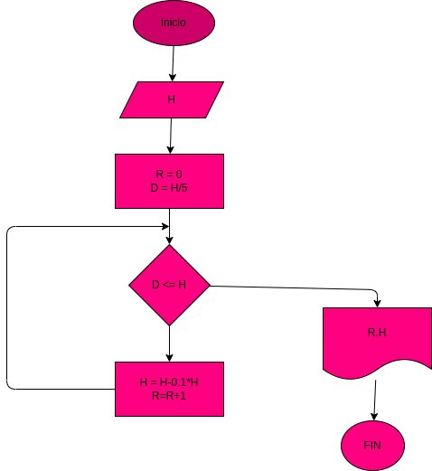

# rebote de una pelota
calcula cuanto rebote una pelota que con cada bote pierde un 10% de altitud

# ANALISIS

--- Variables de entrada 

H : la altura a la cual se tira la pelota

--- variables usadas para el proceso

d : H/5 esto se usas para que cuando H sea menor o igual a d el bucle se detenga

H : la altura incial que poco a poco disminuye un 10%

r : cada vez que se pierde un 10% de altura r aumenta una vez , simulando el numero de rebotes que dio la pelota

--- Variables de salida

H : la altura final alcanzada
r : el numero de rebotes que dio la pelota

# DISEÑO

# CONSTRUCCION

